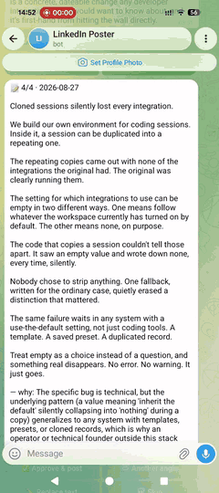
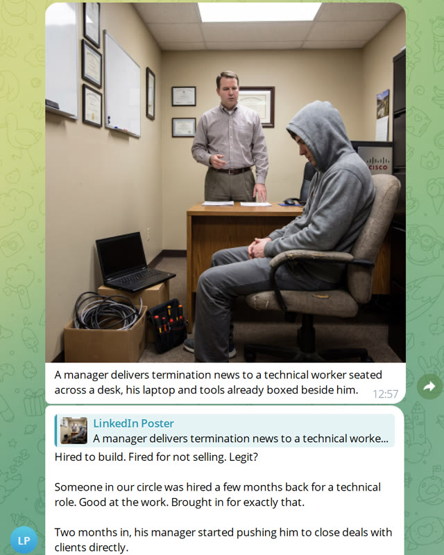
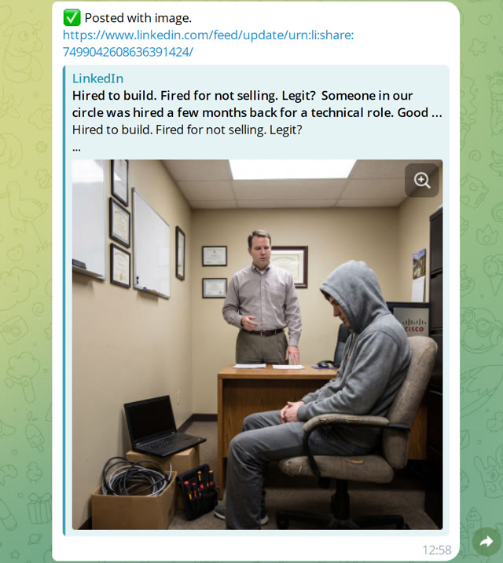
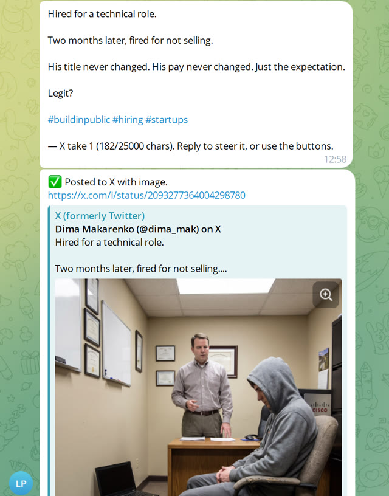
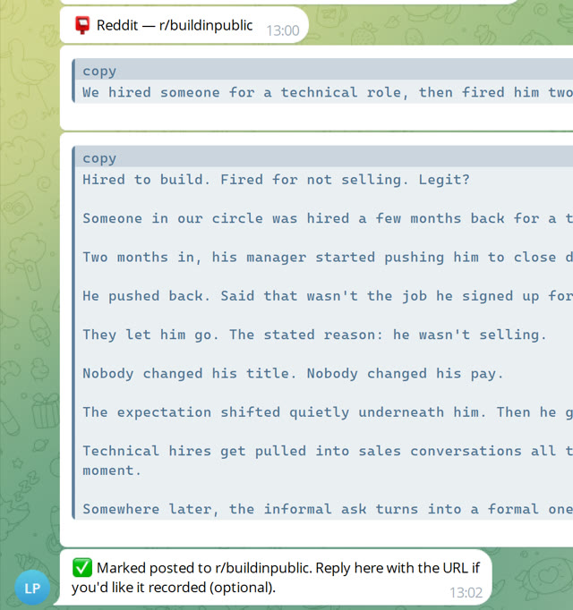

# Social Daily Poster

[](LICENSE)
[](pyproject.toml)

Nobody has the time, or the will, to sit down and write a post every day.
Social Daily Poster does it for you, from what you actually did that day.

Social Daily Poster is the open-source alternative to Taplio: it writes your
LinkedIn posts from the work you already did, on your own machine, for the
price of the AI subscription you already pay for.



## What it does

Every night, Social Daily Poster looks back at your day: your coding-agent
sessions (Claude Code or Codex/ChatGPT), screenshots, and optionally your
Telegram, Gmail, WhatsApp, and even a spoken debrief you record after a call.
It picks the single best story and drafts a post. That draft lands in a
private Telegram bot with **Approve / Edit / Skip** buttons. Approve also
draws an illustration and shows it to you before anything is public.
**Nothing posts until a second tap.**

Once that post is live on LinkedIn, Social Daily Poster can spin off the same
story for **X** (a real rewrite, not a truncation) and **Reddit** (a
prefilled link you submit yourself), each with its own approval step and its
own on/off switch.

<table>
<tr>
<td><br>Confirm the illustration</td>
<td><br>LinkedIn, published</td>
<td><br>X, rewritten and posted</td>
<td><br>Reddit, prefilled for you to submit</td>
</tr>
</table>

Runs on one laptop for one person, no server needed. That's how most people
use it. It can also run on a shared server for a few people.

## Why it's good

- **Posts come from what you actually did.** They read like your week,
  written in your voice.
- **Never auto-publishes, on any platform.** Every channel needs an explicit
  tap after you've seen the exact text (and, for LinkedIn, the exact image).
- **Runs on your own machine.** In laptop mode nothing leaves it except what
  you explicitly approve for posting.
- **Costs close to $0.** Drafting rides on the Claude Code or ChatGPT
  subscription you already pay for (see [Cost](#cost)).
- **Posts through real, official APIs**: LinkedIn and X, not a workaround
  that risks your account. Reddit has no workable automated-posting API for
  a personal project right now, and this README says so plainly (see
  [What it posts to](#what-it-posts-to)).

## Quickstart

**Fastest: hand it to a coding agent.** If you already use a terminal-based
agent (Claude Code, Codex, etc.), open it in an empty folder and give it
this:

```text
Clone https://github.com/dimamak/sdp and set it up locally for one person.
Before running the wizard, ask me which channels I want: Telegram and
LinkedIn are required, then check whether I also want Gmail, WhatsApp,
images, X, or Reddit, don't just leave them off by default. If I don't have
a LinkedIn Page, use https://www.linkedin.com/company/sdp-page/ as a
placeholder. Then walk me through the wizard with those answers.
```

The wizard is interactive by design: you'll still need to answer things
yourself, like pasting a Telegram bot token or approving a LinkedIn login in
your browser. But the agent can drive the whole install and relay each
question to you as it comes up.

**Or run it yourself** (works on Windows, macOS, Linux):

```bash
git clone https://github.com/dimamak/sdp.git && cd sdp
python3 -m venv .venv
.venv/bin/pip install -r requirements.txt        # Windows: .venv\Scripts\pip
.venv/bin/python -m setup.wizard                 # mode? -> laptop (the default)
```

The wizard walks through: which sessions to harvest, your Telegram bot, and
(all optional) Gmail/WhatsApp/LinkedIn/images/X/Reddit. Every step is
re-runnable on its own, e.g. `python -m setup.wizard --source linkedin`.
When it's done:

```bash
python -m server.pipeline.run_nightly --dry-run   # one harvest + digest, no posting
python -m server.bot.main                         # leave this running
```

That one process polls Telegram for your taps and schedules the nightly
draft itself: no cron, nothing else to install. `python -m setup.wizard
--doctor` checks your setup any time.

Want a shared, always-on server for a few people instead of one laptop? See
[Server mode](#server-mode--several-people-on-one-server).

## What it captures

| Source | What it captures | Notes |
|---|---|---|
| Claude Code / Codex / ChatGPT sessions | Your coding-agent transcripts | Read locally; covers Claude Code, the Codex CLI, and the ChatGPT desktop app |
| Screenshots | Whatever you drop into a watched folder | Any OS |
| Telegram, Gmail, WhatsApp | Your own message/mail history | All optional, all off by default; WhatsApp capture is read-only |
| Call / office audio | Local speech-to-text on recordings you make, in whatever languages you actually speak | Off by default; recording and transcription both run on Windows, macOS and Linux |
| Screen activity | Which app and window was in the foreground, plus occasional screenshots — the non-coding half of the day | Off by default; not supported on Wayland (see [Limitations](#limitations--non-goals)) |

Every source is opt-in and walked through by the wizard. `config.example.yaml`
has the full field-by-field detail as inline comments.

## What it posts to

- **LinkedIn**: the official `w_member_social` API. This is the core flow:
  draft → approve → optional illustration → post. Creating the LinkedIn app
  needs an associated LinkedIn Page; if you don't have one, use
  [linkedin.com/company/sdp-page](https://www.linkedin.com/company/sdp-page/),
  a placeholder page for this project that anyone setting up their own
  instance is welcome to use. It isn't tied to any real business and has
  nothing to do with what actually gets posted.
- **X** *(optional, `x.enabled`)*: once a post is live on LinkedIn, the same
  day's story gets a genuine X-length rewrite (LinkedIn drafts run
  1,100–1,600 characters; X's default cap is 280), with its own
  Approve/Rewrite/Skip step. Uses X's official API.
- **Reddit** *(optional, `reddit.enabled`)*: Reddit closed off practical API
  access for a project like this. Social Daily Poster hands you a prefilled
  submit link and ready-to-paste title and body, and you review it and tap
  Submit yourself. Nothing is ever posted by code.

Skipping or failing a later step (X, Reddit) never touches a post already
made on an earlier one. See [Cost](#cost) for what each channel actually
costs to run.

## Images

Approve doesn't publish right away. It first asks the *same session that
wrote the post* for an image brief, renders it, and sends it back with
**Post with image · Regenerate · Post text-only · Cancel**. Reply to steer it
("more abstract, no people") and each reply is a new take; regenerating never
touches LinkedIn, only the final tap does. Turn it off entirely with
`image.enabled: false`.

Every render is checked for broken text — a misspelled word, an invented
brand, a legible dashboard or slide — before it's shown to you. A flagged take
is silently re-rendered once (it never counts against your regeneration
budget, since you never saw it); if the retry is still bad, it's delivered
anyway with a warning in the caption rather than blocking the post. Configure
under `image.text_check*`.

## Publish window

By default, tapping Post with image / Post text-only sends it to LinkedIn
immediately. Set `publish.window` (e.g. `"15:00-18:00"`) and it queues
instead, going out at the next eligible slot on its own — useful if you
approve first thing in the morning but don't want every post landing at the
same hour. **Post now anyway** on the queued message bypasses it for that one
post. `publish.days` caps which weekdays are eligible; `/status` lists what's
currently queued. Leave `publish.window` empty for the old immediate
behaviour.

## Privacy & safety

For a tool that reads your coding transcripts, this is the part that matters
most.

- Everything stays on the machine you configure. In laptop mode, nothing
  ever leaves it except the exact text (and image) you tap to approve.
- The drafting/rewrite step runs the LLM in a restricted mode with no
  general file or tool access.
- WhatsApp capture is read-only by design.
- Audio is transcribed locally, and the recording is deleted once the
  transcript exists. The raw audio never persists.
- Recording other people's conversations has privacy implications of its
  own: don't quote anyone identifiably in a public post (the default style
  guide already forbids it).

See [CONTRIBUTING.md](CONTRIBUTING.md) if you want the exact sandboxing
mechanics behind the Claude vs. Codex backends.

## Cost

| Item | Marginal cost |
|---|---|
| Drafting, image briefs, X/Reddit rewrites, session summaries | ~$0; runs through your existing Claude Code or ChatGPT/Codex subscription's CLI (an API key also works if you'd rather pay per-token) |
| LinkedIn publishing | $0 (official API) |
| Post illustrations *(optional)* | ~$0.13–0.24/render; `image.enabled: false` skips this entirely |
| X posting *(optional)* | Pay-per-use, no free tier; well under $1/month at one post a day |
| Reddit *(optional)* | $0; no API or account, just a link you submit yourself |

At one post a day with images on, expect low-single-digit dollars a month.

## Server mode / several people on one server

For an always-on shared box instead of a laptop, with a separate laptop
feeding it over SSH:

```bash
git clone https://github.com/dimamak/sdp.git && cd sdp
python3 -m venv .venv && .venv/bin/pip install -r requirements.txt
.venv/bin/python -m setup.wizard        # mode? -> server
.venv/bin/python -m setup.wizard --doctor
```

Each additional person gets their own instance: separate config, secrets,
store, Telegram bot, and LinkedIn token, via
`.venv/bin/python -m setup.wizard --instance alice`. People can share one
LinkedIn or X App's credentials the same way a team shares any App: whoever
sets it up first pastes the client id/secret, everyone else just runs their
own login to get their own token (see the wizard's `linkedin`/`x` steps).

Full walkthrough (cron, systemd, Windows laptop push, CI auto-deploy) lives
in [docs/self-hosting/ci-deploy.md](docs/self-hosting/ci-deploy.md) and the
wizard's own prompts.

## Limitations & non-goals

- **Only local coding-agent history is read.** Codex Cloud tasks and the
  plain ChatGPT web/desktop chat tab aren't in the local session store, so
  they aren't harvested.
- **WhatsApp carries real, if low, ToS/ban risk**: it goes through an
  unofficial client, not WhatsApp's Business API. Read-only by design.
- **Reddit is draft-assist only, never automated posting** (see
  [What it posts to](#what-it-posts-to)).
- **Audio and screen capture need the bot process to be running.** In laptop
  mode both recorders are threads inside it, so capture stops when it stops.
  The wizard registers an OS-native autostart (systemd `--user`, launchd, or
  a Task Scheduler logon task) so it comes back at login, and `--doctor`
  fails if the bot hasn't checked in.
- **Screen activity capture doesn't work on Wayland.** There's no
  compositor-independent way to read the foreground window, or to grab the
  screen without a portal prompt per shot. The recorder refuses to start
  there rather than logging `?` all day; an X11 session works. On macOS,
  window *titles* additionally need Accessibility permission — without it you
  get app names only.

## Contributing / Security / Licence

- Found a bug or want a feature? See [CONTRIBUTING.md](CONTRIBUTING.md).
- Found a security issue? See [SECURITY.md](SECURITY.md). Please don't open
  a public issue for anything that touches credentials or account safety.
- [LICENSE](LICENSE): MIT.
